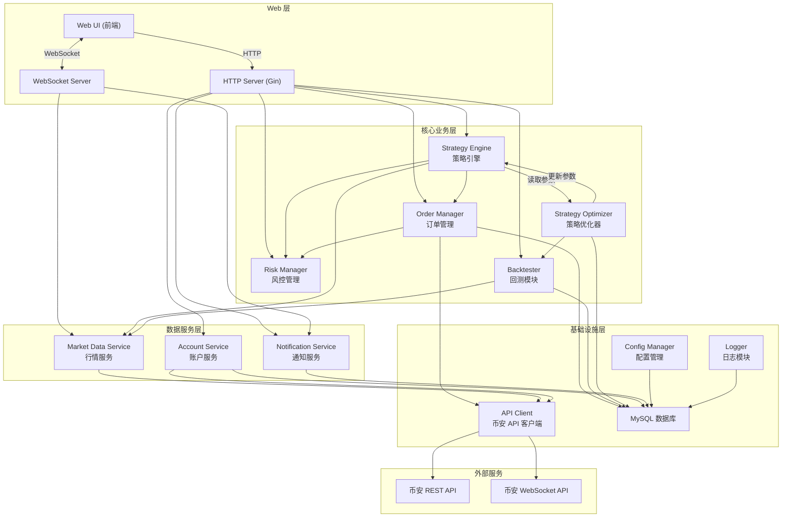
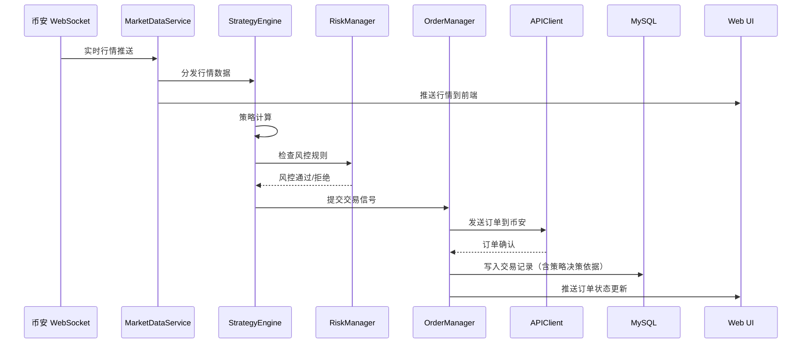
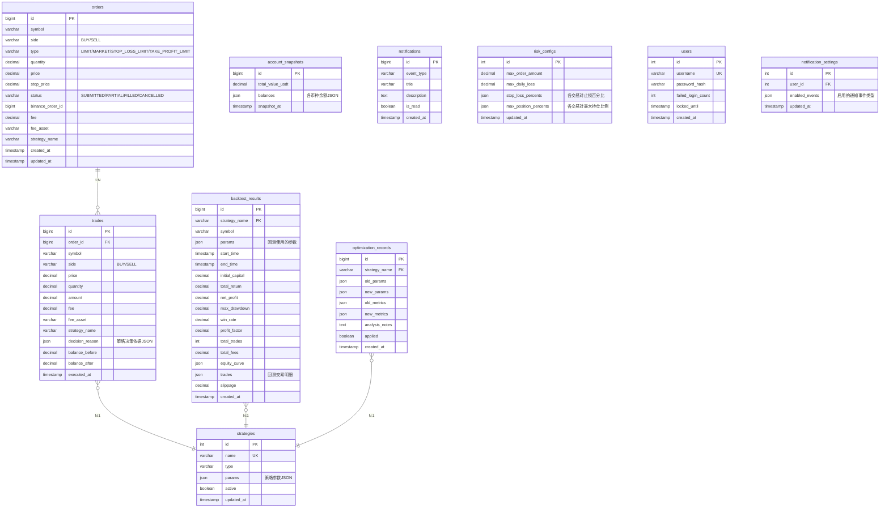

# 技术设计文档：币安加密货币交易系统

## 概述

本系统是一个基于 Go 语言的全自动加密货币交易平台，通过接入币安 API 实现行情获取、自动策略交易、风险控制、历史回测和策略自我优化。系统采用模块化架构，核心模块包括 API 客户端、行情服务、订单管理、策略引擎、回测器、策略优化器、风控管理、账户服务、通知服务和 Web UI。

系统使用 MySQL 作为持久化存储，记录所有交易记录（含策略决策依据）、回测结果、策略优化历史和账户快照。Web UI 通过 WebSocket 实现实时数据推送，提供 K线图表、订单管理、资产概览、回测结果展示和策略优化历史面板。

关键设计决策：
- Go 语言：高并发性能适合实时行情处理和多策略并行计算
- MySQL：成熟的关系型数据库，适合结构化交易数据存储和复杂查询
- WebSocket 双向通信：币安行情推送 + Web UI 实时更新
- 策略引擎自动决策：用户无需配置策略参数，系统自动评估市场并选择策略
- 所有盈亏计算均扣除交易手续费

## 架构

### 系统架构图



### 技术栈

| 层级 | 技术选型 | 说明 |
|------|---------|------|
| 语言 | Go 1.21+ | 高并发、编译型语言 |
| Web 框架 | Gin | 高性能 HTTP 框架 |
| WebSocket | gorilla/websocket | Go 生态成熟的 WebSocket 库 |
| 数据库 | MySQL 8.0+ | 关系型数据库 |
| ORM | GORM | Go 语言 ORM 框架 |
| 前端 | React + TypeScript | SPA 单页应用 |
| 图表 | Lightweight Charts (TradingView) | 专业 K线图表库 |
| 配置 | YAML + Viper | 配置文件管理 |
| 日志 | Zap | 高性能结构化日志 |
| 加密 | Go crypto/aes | AES-256 加密 |
| 定时任务 | robfig/cron | 定时触发策略优化 |

### 模块通信模式



## 组件与接口

### 1. API Client（币安 API 客户端）

负责与币安 REST API 和 WebSocket API 的所有通信。

```go
// pkg/binance/client.go
type BinanceClient struct {
    apiKey    string
    secretKey string
    baseURL   string
    wsURL     string
    httpClient *http.Client
    signer    *HMACSigner
}

type HMACSigner struct {
    secretKey []byte
}

// 签名方法：HMAC-SHA256
func (s *HMACSigner) Sign(payload string) string

// REST API 方法
func (c *BinanceClient) GetKlines(symbol string, interval string, startTime, endTime int64) ([]Kline, error)
func (c *BinanceClient) CreateOrder(req CreateOrderRequest) (*OrderResponse, error)
func (c *BinanceClient) CancelOrder(symbol string, orderID int64) (*OrderResponse, error)
func (c *BinanceClient) GetAccountInfo() (*AccountInfo, error)
func (c *BinanceClient) GetExchangeInfo() (*ExchangeInfo, error)
func (c *BinanceClient) GetOrderBook(symbol string, limit int) (*OrderBook, error)

// WebSocket 方法
func (c *BinanceClient) SubscribeKline(symbol, interval string, handler KlineHandler) error
func (c *BinanceClient) SubscribeOrderBook(symbol string, handler OrderBookHandler) error
func (c *BinanceClient) SubscribeUserData(handler UserDataHandler) error
```

连接管理：
- 自动重连机制：断线后 3 秒内重试，最多 5 次，指数退避
- WebSocket 心跳：每 30 秒发送 ping，超时 60 秒判定断线
- 请求限速：遵守币安 API 限速规则（1200 次/分钟）

### 2. Market Data Service（行情服务）

管理实时行情数据的获取和分发。

```go
// internal/market/service.go
type MarketDataService struct {
    client       *BinanceClient
    subscribers  map[string][]DataConsumer
    klineCache   map[string][]Kline
    orderBooks   map[string]*OrderBook
    mu           sync.RWMutex
}

type DataConsumer interface {
    OnKlineUpdate(symbol string, kline Kline)
    OnOrderBookUpdate(symbol string, book *OrderBook)
    OnPriceUpdate(symbol string, price decimal.Decimal)
}

func (s *MarketDataService) Subscribe(symbol string, consumer DataConsumer) error
func (s *MarketDataService) Unsubscribe(symbol string, consumer DataConsumer) error
func (s *MarketDataService) GetHistoricalKlines(symbol, interval string, start, end time.Time) ([]Kline, error)
func (s *MarketDataService) GetCurrentPrice(symbol string) (decimal.Decimal, error)
func (s *MarketDataService) GetOrderBook(symbol string) (*OrderBook, error)
```

支持的 K线周期：1m, 5m, 15m, 1h, 4h, 1d

### 3. Strategy Engine（策略引擎）

自动选择和执行交易策略，无需用户配置。

```go
// internal/strategy/engine.go
type StrategyEngine struct {
    strategies    []Strategy
    marketData    *MarketDataService
    orderManager  *OrderManager
    riskManager   *RiskManager
    optimizer     *StrategyOptimizer
    running       atomic.Bool
    signalChan    chan Signal
    db            *gorm.DB
}

type Strategy interface {
    Name() string
    Calculate(klines []Kline) (*Signal, error)
    GetParams() StrategyParams
    SetParams(params StrategyParams)
    EstimateFee(signal *Signal, feeRate FeeRate) decimal.Decimal
}

type Signal struct {
    Strategy   string
    Symbol     string
    Direction  SignalDirection // BUY or SELL
    Price      decimal.Decimal
    Quantity   decimal.Decimal
    Timestamp  time.Time
    Reason     SignalReason // 策略决策依据
}

type SignalReason struct {
    Indicators   map[string]float64 // 当时的技术指标数值
    TriggerRule  string             // 信号触发条件
    MarketState  string             // 市场状态评估
}

func (e *StrategyEngine) Start(ctx context.Context) error
func (e *StrategyEngine) Stop() error
func (e *StrategyEngine) EvaluateMarket(symbol string) (Strategy, error)
```

内置策略实现：

```go
// internal/strategy/ma_cross.go
type MACrossStrategy struct {
    ShortPeriod int // 默认 7
    LongPeriod  int // 默认 25
}

// internal/strategy/rsi.go
type RSIStrategy struct {
    Period        int     // 默认 14
    OverboughtLvl float64 // 默认 70
    OversoldLvl   float64 // 默认 30
}

// internal/strategy/bollinger.go
type BollingerStrategy struct {
    Period     int     // 默认 20
    StdDevMult float64 // 默认 2.0
}
```

### 4. Order Manager（订单管理）

```go
// internal/order/manager.go
type OrderManager struct {
    client      *BinanceClient
    riskManager *RiskManager
    db          *gorm.DB
    notifier    *NotificationService
}

type CreateOrderRequest struct {
    Symbol    string
    Side      OrderSide      // BUY / SELL
    Type      OrderType      // LIMIT / MARKET / STOP_LOSS_LIMIT / TAKE_PROFIT_LIMIT
    Quantity  decimal.Decimal
    Price     decimal.Decimal
    StopPrice decimal.Decimal // 止损/止盈触发价
}

func (m *OrderManager) SubmitOrder(req CreateOrderRequest, reason SignalReason) (*Order, error)
func (m *OrderManager) CancelOrder(symbol string, orderID int64) error
func (m *OrderManager) GetActiveOrders(symbol string) ([]Order, error)
func (m *OrderManager) GetOrderHistory(filter OrderFilter) ([]Order, error)
func (m *OrderManager) ExportCSV(filter OrderFilter, writer io.Writer) error
```

订单提交前验证：
- 检查交易对是否存在
- 验证数量精度和最小交易量
- 验证价格精度
- 通过 RiskManager 检查风控规则

### 5. Risk Manager（风控管理）

```go
// internal/risk/manager.go
type RiskManager struct {
    config     RiskConfig
    db         *gorm.DB
    accountSvc *AccountService
    notifier   *NotificationService
}

type RiskConfig struct {
    MaxOrderAmount     decimal.Decimal            // 单笔最大金额 (USDT)
    MaxDailyLoss       decimal.Decimal            // 每日最大亏损 (USDT)
    StopLossPercent    map[string]decimal.Decimal  // 每个交易对的止损百分比
    MaxPositionPercent map[string]decimal.Decimal  // 每个交易对的最大持仓比例
}

func (r *RiskManager) CheckOrder(req CreateOrderRequest) error
func (r *RiskManager) CheckDailyLoss() (bool, error)
func (r *RiskManager) CheckPositionLimit(symbol string, amount decimal.Decimal) error
func (r *RiskManager) GetDailyPnL() (decimal.Decimal, error) // 含手续费
func (r *RiskManager) PauseAllStrategies() error
```

### 6. Backtester（回测模块）

```go
// internal/backtest/backtester.go
type Backtester struct {
    marketData *MarketDataService
    db         *gorm.DB
}

type BacktestConfig struct {
    Symbol     string
    Strategy   Strategy
    StartTime  time.Time
    EndTime    time.Time
    InitialCap decimal.Decimal
    FeeRate    FeeRate
    Slippage   decimal.Decimal // 滑点百分比
}

type FeeRate struct {
    Maker decimal.Decimal // 默认 0.1%
    Taker decimal.Decimal // 默认 0.1%
}

type BacktestResult struct {
    ID              uint
    Config          BacktestConfig
    TotalReturn     decimal.Decimal // 总收益率
    NetProfit       decimal.Decimal // 净收益（扣除手续费）
    MaxDrawdown     decimal.Decimal // 最大回撤
    WinRate         decimal.Decimal // 胜率
    ProfitFactor    decimal.Decimal // 盈亏比
    TotalTrades     int             // 总交易次数
    TotalFees       decimal.Decimal // 总手续费
    Trades          []BacktestTrade // 每笔交易明细
    EquityCurve     []EquityPoint   // 权益曲线
}

func (b *Backtester) Run(config BacktestConfig) (*BacktestResult, error)
func (b *Backtester) BatchRun(configs []BacktestConfig) ([]BacktestResult, error)
func (b *Backtester) GetResults(strategyName string) ([]BacktestResult, error)
```

### 7. Strategy Optimizer（策略优化器）

```go
// internal/optimizer/optimizer.go
type StrategyOptimizer struct {
    backtester     *Backtester
    strategyEngine *StrategyEngine
    db             *gorm.DB
    notifier       *NotificationService
    config         OptimizerConfig
}

type OptimizerConfig struct {
    Interval       time.Duration // 优化周期，默认 24h
    LookbackDays   int           // 回看天数，默认 30
    MaxParamChange float64       // 单次最大参数变化幅度，默认 0.3 (30%)
}

type OptimizationRecord struct {
    ID              uint
    StrategyName    string
    OldParams       StrategyParams
    NewParams       StrategyParams
    OldMetrics      BacktestResult
    NewMetrics      BacktestResult
    AnalysisNotes   string // 从历史交易记录提取的分析结论
    Applied         bool
    Timestamp       time.Time
}

func (o *StrategyOptimizer) RunOptimization(ctx context.Context) error
func (o *StrategyOptimizer) GetHistory() ([]OptimizationRecord, error)
```

优化流程：
1. 从 MySQL 读取历史交易记录，分析策略表现
2. 在当前参数 ±30% 范围内生成候选参数组合
3. 对每个候选参数进行回测（含手续费和滑点）
4. 以净收益率为主要目标，兼顾最大回撤和胜率
5. 若最优候选优于当前参数，自动更新策略引擎参数
6. 若最优候选净收益为负，保留当前参数并通知用户

### 8. Account Service（账户服务）

```go
// internal/account/service.go
type AccountService struct {
    client   *BinanceClient
    db       *gorm.DB
    cache    *AccountCache
}

func (s *AccountService) GetBalances() ([]Balance, error)
func (s *AccountService) GetTotalAssetValue() (decimal.Decimal, error) // USDT 计价
func (s *AccountService) GetPositionPnL(symbol string) (*PnL, error)  // 含手续费扣除
func (s *AccountService) GetAssetHistory(start, end time.Time) ([]AssetSnapshot, error)
func (s *AccountService) GetFeeStats() (*FeeStatistics, error) // 累计手续费统计
```

### 9. Notification Service（通知服务）

```go
// internal/notification/service.go
type NotificationService struct {
    db          *gorm.DB
    wsHub       *WebSocketHub
    eventFilter map[EventType]bool
}

type Notification struct {
    ID          uint
    EventType   EventType
    Title       string
    Description string
    Read        bool
    CreatedAt   time.Time
}

type EventType string
const (
    EventOrderFilled       EventType = "ORDER_FILLED"
    EventSignalTriggered   EventType = "SIGNAL_TRIGGERED"
    EventRiskAlert         EventType = "RISK_ALERT"
    EventAPIDisconnect     EventType = "API_DISCONNECT"
    EventBacktestComplete  EventType = "BACKTEST_COMPLETE"
    EventOptimizeComplete  EventType = "OPTIMIZE_COMPLETE"
)

func (s *NotificationService) Send(eventType EventType, title, desc string) error
func (s *NotificationService) GetNotifications(filter NotificationFilter) ([]Notification, error)
func (s *NotificationService) MarkAsRead(id uint) error
func (s *NotificationService) SetEventFilter(filters map[EventType]bool) error
```

### 10. Web UI HTTP/WebSocket Server

```go
// internal/server/router.go
// HTTP API 路由
// GET    /api/v1/market/klines/:symbol       获取 K线数据
// GET    /api/v1/market/orderbook/:symbol     获取订单簿
// POST   /api/v1/orders                       创建订单
// DELETE /api/v1/orders/:id                   取消订单
// GET    /api/v1/orders                       查询订单列表
// GET    /api/v1/orders/export                导出 CSV
// GET    /api/v1/account/balances             获取余额
// GET    /api/v1/account/pnl                  获取盈亏
// GET    /api/v1/account/fees                 获取手续费统计
// POST   /api/v1/strategy/start               启动自动交易
// POST   /api/v1/strategy/stop                停止自动交易
// GET    /api/v1/strategy/status              获取策略状态
// GET    /api/v1/risk/config                  获取风控配置
// PUT    /api/v1/risk/config                  更新风控配置
// POST   /api/v1/backtest/run                 运行回测
// GET    /api/v1/backtest/results             获取回测结果
// GET    /api/v1/optimizer/history            获取优化历史
// GET    /api/v1/notifications                获取通知列表
// PUT    /api/v1/notifications/:id/read       标记已读
// PUT    /api/v1/notifications/settings       更新通知设置
// GET    /api/v1/trades                       查询交易记录
// POST   /api/v1/auth/login                   用户登录

// WebSocket 端点
// WS /ws  实时数据推送（行情、订单状态、通知）
```

### 11. Config Manager（配置管理）

```go
// internal/config/config.go
type Config struct {
    Server   ServerConfig   `yaml:"server"`
    Binance  BinanceConfig  `yaml:"binance"`
    Database DatabaseConfig `yaml:"database"`
    Log      LogConfig      `yaml:"log"`
    Trading  TradingConfig  `yaml:"trading"`
    Risk     RiskConfig     `yaml:"risk"`
    Optimizer OptimizerConfig `yaml:"optimizer"`
}

type BinanceConfig struct {
    APIKey    string `yaml:"api_key"`    // AES-256 加密存储
    SecretKey string `yaml:"secret_key"` // AES-256 加密存储
    BaseURL   string `yaml:"base_url"`
    WsURL     string `yaml:"ws_url"`
}

type DatabaseConfig struct {
    Host     string `yaml:"host"`
    Port     int    `yaml:"port"`
    User     string `yaml:"user"`
    Password string `yaml:"password"` // AES-256 加密存储
    DBName   string `yaml:"db_name"`
}
```

## 数据模型

### MySQL 数据库表结构



### 关键数据结构

```go
// 交易记录 - 包含完整策略决策依据
type Trade struct {
    ID             uint            `gorm:"primaryKey"`
    OrderID        uint            `gorm:"index"`
    Symbol         string          `gorm:"size:20;index"`
    Side           string          `gorm:"size:4"` // BUY/SELL
    Price          decimal.Decimal `gorm:"type:decimal(20,8)"`
    Quantity       decimal.Decimal `gorm:"type:decimal(20,8)"`
    Amount         decimal.Decimal `gorm:"type:decimal(20,8)"`
    Fee            decimal.Decimal `gorm:"type:decimal(20,8)"`
    FeeAsset       string          `gorm:"size:10"`
    StrategyName   string          `gorm:"size:50;index"`
    DecisionReason JSON            `gorm:"type:json"` // SignalReason 序列化
    BalanceBefore  decimal.Decimal `gorm:"type:decimal(20,8)"`
    BalanceAfter   decimal.Decimal `gorm:"type:decimal(20,8)"`
    ExecutedAt     time.Time       `gorm:"index"`
}

// 策略决策依据 JSON 结构
type DecisionReasonJSON struct {
    Indicators   map[string]float64 `json:"indicators"`    // 如 {"MA7": 42350.5, "MA25": 41800.2, "RSI": 65.3}
    TriggerRule  string             `json:"trigger_rule"`  // 如 "MA7 上穿 MA25，形成金叉"
    MarketState  string             `json:"market_state"`  // 如 "上升趋势，成交量放大"
}

// K线数据
type Kline struct {
    OpenTime  time.Time
    Open      decimal.Decimal
    High      decimal.Decimal
    Low       decimal.Decimal
    Close     decimal.Decimal
    Volume    decimal.Decimal
    CloseTime time.Time
}

// 订单簿
type OrderBook struct {
    Symbol string
    Bids   []PriceLevel // 买盘 (价格从高到低)
    Asks   []PriceLevel // 卖盘 (价格从低到高)
    UpdateTime time.Time
}

type PriceLevel struct {
    Price    decimal.Decimal
    Quantity decimal.Decimal
}
```

### 项目目录结构

```
money-loves-me/
├── cmd/
│   └── server/
│       └── main.go              # 程序入口
├── configs/
│   └── config.yaml              # 配置文件
├── internal/
│   ├── account/
│   │   └── service.go           # 账户服务
│   ├── backtest/
│   │   └── backtester.go        # 回测模块
│   ├── config/
│   │   ├── config.go            # 配置结构
│   │   └── crypto.go            # AES-256 加解密
│   ├── market/
│   │   └── service.go           # 行情服务
│   ├── notification/
│   │   └── service.go           # 通知服务
│   ├── optimizer/
│   │   └── optimizer.go         # 策略优化器
│   ├── order/
│   │   └── manager.go           # 订单管理
│   ├── risk/
│   │   └── manager.go           # 风控管理
│   ├── server/
│   │   ├── router.go            # HTTP 路由
│   │   ├── handler.go           # HTTP 处理器
│   │   └── websocket.go         # WebSocket 处理
│   └── strategy/
│       ├── engine.go            # 策略引擎
│       ├── ma_cross.go          # 均线交叉策略
│       ├── rsi.go               # RSI 策略
│       └── bollinger.go         # 布林带策略
├── pkg/
│   └── binance/
│       ├── client.go            # 币安 API 客户端
│       ├── rest.go              # REST API 封装
│       ├── websocket.go         # WebSocket 封装
│       └── signer.go            # HMAC-SHA256 签名
├── web/                         # React 前端
│   ├── src/
│   │   ├── components/          # UI 组件
│   │   ├── pages/               # 页面
│   │   ├── services/            # API 调用
│   │   └── App.tsx
│   └── package.json
├── migrations/                  # 数据库迁移脚本
├── go.mod
├── go.sum
└── Makefile
```

## 正确性属性

*属性（Property）是指在系统所有有效执行中都应保持为真的特征或行为——本质上是对系统应做什么的形式化陈述。属性是人类可读规格说明与机器可验证正确性保证之间的桥梁。*

### Property 1: AES-256 加密解密往返

*对于任意*字符串（API Key、Secret Key、数据库密码），使用 AES-256 加密后再解密，应得到与原始字符串完全相同的值；且加密后的密文不应包含原始明文。

**Validates: Requirements 1.4, 12.2**

### Property 2: HMAC-SHA256 签名验证

*对于任意*请求载荷和密钥，使用 HMAC-SHA256 签名函数生成的签名应通过标准 HMAC-SHA256 验证；且相同载荷和密钥始终产生相同签名，不同载荷产生不同签名。

**Validates: Requirements 1.3**

### Property 3: 无效凭证返回结构化错误

*对于任意*无效的 API Key 或 Secret Key，API_Client 的认证请求应返回包含错误码和错误描述的错误响应，且不应返回成功状态。

**Validates: Requirements 1.2**

### Property 4: 订单参数验证正确性

*对于任意*订单请求，若数量精度超出交易对规定、数量低于最小交易量、或价格精度超出规定，订单验证器应拒绝该订单并返回具体的验证错误信息；若所有参数均符合规则，验证器应通过。

**Validates: Requirements 3.2**

### Property 5: 数据持久化往返

*对于任意*交易记录、订单记录、回测结果或策略优化记录，写入 MySQL 数据库后再读取，应得到与原始数据等价的记录（所有字段值一致）。

**Validates: Requirements 9.1, 3.6, 10.6**

### Property 6: 交易记录完整性

*对于任意*写入数据库的交易记录，必须包含以下非空字段：交易时间、交易对、交易方向、成交价格、成交数量、成交金额、交易手续费、触发策略名称、策略决策依据（含技术指标数值、信号触发条件、市场状态评估）、订单 ID、交易前后账户余额。

**Validates: Requirements 9.2, 4.3**

### Property 7: 策略自动初始化有效默认参数

*对于任意*内置策略（MA Cross、RSI、Bollinger），调用 GetParams() 应返回所有参数均为正数的有效默认参数集，且这些参数应在各策略的合理范围内。

**Validates: Requirements 4.2**

### Property 8: 停止交易后不产生新信号

*对于任意*策略引擎运行状态，调用 Stop() 后，无论后续接收到多少行情数据更新，策略引擎不应生成任何新的交易信号。

**Validates: Requirements 4.6**

### Property 9: 手续费感知的信号生成

*对于任意*由策略引擎生成的交易信号，该信号的预期收益在扣除预估交易手续费后必须为正值；若扣除手续费后预期收益为零或负值，该信号不应被生成。

**Validates: Requirements 4.8**

### Property 10: 总资产价值计算正确性

*对于任意*账户余额集合和对应的实时 USDT 价格，计算得到的总资产价值应等于每个币种余额乘以其 USDT 价格的总和。

**Validates: Requirements 5.3**

### Property 11: 盈亏计算包含手续费

*对于任意*交易对的一组买入和卖出交易记录，计算得到的持仓盈亏应等于（卖出总金额 - 买入总金额 - 总交易手续费）；累计手续费统计应等于所有单笔交易手续费之和。

**Validates: Requirements 5.4, 5.6, 6.8**

### Property 12: 时间范围和条件过滤正确性

*对于任意*时间范围查询和筛选条件（交易对、策略名称），返回的所有记录的时间戳必须在指定范围内，且所有记录必须匹配指定的筛选条件。

**Validates: Requirements 5.5, 7.5, 9.7, 10.7**

### Property 13: 风控拒绝超限订单

*对于任意*订单，若其金额超过配置的单笔最大金额上限，或若该订单将导致某交易对持仓比例超过配置的最大持仓比例，Risk_Manager 应拒绝该订单。

**Validates: Requirements 6.3, 6.7**

### Property 14: 每日亏损阈值触发策略暂停

*对于任意*交易序列，当当日累计亏损（含交易手续费）达到或超过配置的每日最大亏损上限时，Risk_Manager 应暂停所有运行中的策略。

**Validates: Requirements 6.4**

### Property 15: 止损信号在阈值触发

*对于任意*持仓和配置的止损百分比，当持仓亏损百分比达到或超过配置的止损阈值时，Risk_Manager 应生成止损卖出信号。

**Validates: Requirements 6.5**

### Property 16: WebSocket 断线重订阅

*对于任意*已订阅的数据流集合，当 WebSocket 连接断开并重新建立后，之前订阅的所有数据流应被自动重新订阅，订阅集合应与断线前一致。

**Validates: Requirements 2.6**

### Property 17: 通知时间倒序和事件过滤

*对于任意*通知列表查询，返回的通知应按创建时间严格倒序排列；当用户配置了事件类型过滤器时，仅匹配已启用事件类型的通知应被返回。

**Validates: Requirements 8.4, 8.5**

### Property 18: 事件触发通知生成

*对于任意*指定事件类型（订单成交、策略信号触发、风控告警、API 连接异常、回测完成、策略参数优化完成），当该事件发生时，应生成包含时间戳、事件类型和详细描述的通知记录。

**Validates: Requirements 8.1, 8.3**

### Property 19: 回测手续费计算正确性

*对于任意*回测交易，其手续费应等于成交金额乘以对应的费率（Maker 或 Taker）；回测报告中的总手续费应等于所有单笔交易手续费之和。

**Validates: Requirements 10.2**

### Property 20: 回测报告指标一致性

*对于任意*回测结果，净收益应等于总收益减去总手续费；胜率应等于盈利交易数除以总交易数；总交易次数应等于交易明细列表的长度。

**Validates: Requirements 10.3**

### Property 21: 回测滑点模拟

*对于任意*回测交易，实际执行价格与信号价格之间的差异应等于配置的滑点百分比乘以信号价格（买入时价格上浮，卖出时价格下浮）。

**Validates: Requirements 10.5**

### Property 22: 优化器以净收益率为目标

*对于任意*两组策略参数的回测结果，优化器应选择扣除手续费后净收益率更高的参数组合（在最大回撤和胜率约束满足的前提下）。

**Validates: Requirements 11.4**

### Property 23: 优化器参数变化幅度限制

*对于任意*策略参数优化，每个参数的变化幅度（|新值 - 旧值| / 旧值）不应超过 30%。

**Validates: Requirements 11.7**

### Property 24: 优化器决策正确性

*对于任意*优化运行，若最优候选参数的回测净收益为正且优于当前参数，则策略引擎参数应被更新；若最优候选参数的回测净收益为负，则当前参数应保持不变。

**Validates: Requirements 11.5, 11.8**

### Property 25: YAML 配置解析往返

*对于任意*有效的系统配置结构体，序列化为 YAML 后再反序列化，应得到与原始配置等价的结构体。

**Validates: Requirements 12.1**

### Property 26: 配置验证拒绝无效配置

*对于任意*缺少必填字段或字段类型错误的配置文件，配置验证器应返回明确的错误信息并拒绝加载。

**Validates: Requirements 12.6**

### Property 27: 账户锁定机制

*对于任意*用户账户，连续 3 次登录失败后，该账户应被锁定 15 分钟；在锁定期间，即使提供正确密码也应拒绝登录。

**Validates: Requirements 12.5**

### Property 28: CSV 导出往返

*对于任意*交易记录集合，导出为 CSV 后再解析，应得到与原始记录等价的数据（字段值一致）。

**Validates: Requirements 9.5**

### Property 29: 策略配置启动恢复

*对于任意*已保存的策略配置和风控参数，系统重启后从 MySQL 恢复的配置应与重启前保存的配置完全一致。

**Validates: Requirements 9.4**

### Property 30: 结构化日志完整性

*对于任意*日志条目，必须包含时间戳、模块名称、日志级别（DEBUG/INFO/WARN/ERROR）和日志内容四个字段，且均不为空。

**Validates: Requirements 9.3**

## 错误处理

### 错误分类

| 错误类别 | 示例 | 处理策略 |
|---------|------|---------|
| 网络错误 | API 连接超时、WebSocket 断线 | 自动重试（指数退避），最多 5 次；超限后通知用户 |
| 认证错误 | 无效 API Key、签名错误 | 返回结构化错误（错误码+描述），不重试 |
| 业务验证错误 | 订单参数不合规、余额不足 | 返回具体验证错误信息，拒绝操作 |
| 风控拦截 | 超过单笔限额、超过持仓比例 | 拒绝订单，通知用户，记录日志 |
| 数据库错误 | MySQL 连接失败、写入失败 | 重试 3 次，失败后记录错误日志并降级运行 |
| 配置错误 | YAML 格式错误、缺少必填字段 | 启动时验证，无效则拒绝启动并输出错误信息 |
| 币安 API 错误 | 限速、服务不可用 | 根据错误码分类处理：限速则等待后重试，服务不可用则降级 |

### 错误传播机制

```go
// 统一错误类型
type AppError struct {
    Code    ErrorCode
    Message string
    Cause   error
    Module  string
}

type ErrorCode int
const (
    ErrNetwork      ErrorCode = 1000
    ErrAuth         ErrorCode = 2000
    ErrValidation   ErrorCode = 3000
    ErrRiskControl  ErrorCode = 4000
    ErrDatabase     ErrorCode = 5000
    ErrConfig       ErrorCode = 6000
    ErrBinanceAPI   ErrorCode = 7000
)
```

### 关键错误处理流程

1. **API 连接断开**：APIClient 检测断线 → 3 秒后重试 → 指数退避重试最多 5 次 → 失败则记录日志 + 通知用户 + 暂停依赖 API 的策略
2. **订单提交失败**：OrderManager 捕获错误 → 记录失败原因到日志 → 通知用户 → 不自动重试（避免重复下单）
3. **每日亏损超限**：RiskManager 检测到超限 → 暂停所有策略 → 通知用户 → 记录风控事件日志
4. **数据库写入失败**：重试 3 次 → 失败后将数据写入本地文件作为备份 → 记录错误日志 → 数据库恢复后自动同步
5. **策略优化失败**：记录错误日志 → 保留当前参数不变 → 通知用户 → 下个周期重试

### 优雅降级

- 行情 WebSocket 断线时，自动切换到 REST API 轮询模式（降低频率）
- 数据库不可用时，关键数据（订单、交易）写入本地文件备份
- 策略优化失败时，继续使用当前参数运行

## 测试策略

### 双重测试方法

本系统采用单元测试和属性测试相结合的双重测试策略：

- **单元测试**：验证具体示例、边界情况和错误条件
- **属性测试**：验证跨所有输入的通用属性

两者互补，共同提供全面的测试覆盖。

### 属性测试配置

- **属性测试库**：[`pgregory.net/rapid`](https://github.com/flyingmutant/rapid)（Go 语言属性测试库）
- **每个属性测试最少运行 100 次迭代**
- **每个属性测试必须通过注释引用设计文档中的属性编号**
- **标签格式**：`Feature: binance-trading-system, Property {number}: {property_text}`
- **每个正确性属性由一个属性测试实现**

### 单元测试范围

单元测试聚焦于：
- 具体示例验证（如特定 K线数据下的策略信号）
- 边界情况（如空数据、零值、极端价格）
- 错误条件（如无效参数、网络超时模拟）
- 集成点验证（如 API 响应解析、数据库 CRUD）

### 属性测试范围

每个正确性属性对应一个属性测试，覆盖：

| 属性编号 | 测试描述 | 测试模块 |
|---------|---------|---------|
| Property 1 | AES-256 加密解密往返 | `internal/config/crypto_test.go` |
| Property 2 | HMAC-SHA256 签名验证 | `pkg/binance/signer_test.go` |
| Property 3 | 无效凭证错误响应 | `pkg/binance/client_test.go` |
| Property 4 | 订单参数验证 | `internal/order/validator_test.go` |
| Property 5 | 数据持久化往返 | `internal/store/persistence_test.go` |
| Property 6 | 交易记录完整性 | `internal/order/trade_test.go` |
| Property 7 | 策略默认参数有效性 | `internal/strategy/engine_test.go` |
| Property 8 | 停止后无新信号 | `internal/strategy/engine_test.go` |
| Property 9 | 手续费感知信号生成 | `internal/strategy/engine_test.go` |
| Property 10 | 总资产价值计算 | `internal/account/service_test.go` |
| Property 11 | 盈亏含手续费计算 | `internal/account/service_test.go` |
| Property 12 | 时间范围过滤 | `internal/store/query_test.go` |
| Property 13 | 风控拒绝超限订单 | `internal/risk/manager_test.go` |
| Property 14 | 每日亏损阈值暂停 | `internal/risk/manager_test.go` |
| Property 15 | 止损信号触发 | `internal/risk/manager_test.go` |
| Property 16 | WebSocket 重订阅 | `internal/market/service_test.go` |
| Property 17 | 通知排序和过滤 | `internal/notification/service_test.go` |
| Property 18 | 事件触发通知 | `internal/notification/service_test.go` |
| Property 19 | 回测手续费计算 | `internal/backtest/backtester_test.go` |
| Property 20 | 回测报告指标一致性 | `internal/backtest/backtester_test.go` |
| Property 21 | 回测滑点模拟 | `internal/backtest/backtester_test.go` |
| Property 22 | 优化器净收益目标 | `internal/optimizer/optimizer_test.go` |
| Property 23 | 参数变化幅度限制 | `internal/optimizer/optimizer_test.go` |
| Property 24 | 优化器决策正确性 | `internal/optimizer/optimizer_test.go` |
| Property 25 | YAML 配置往返 | `internal/config/config_test.go` |
| Property 26 | 配置验证拒绝无效 | `internal/config/config_test.go` |
| Property 27 | 账户锁定机制 | `internal/server/auth_test.go` |
| Property 28 | CSV 导出往返 | `internal/order/export_test.go` |
| Property 29 | 策略配置启动恢复 | `internal/config/restore_test.go` |
| Property 30 | 结构化日志完整性 | `internal/logger/logger_test.go` |

### 测试示例

```go
// Feature: binance-trading-system, Property 1: AES-256 加密解密往返
func TestAESEncryptionRoundTrip(t *testing.T) {
    rapid.Check(t, func(t *rapid.T) {
        plaintext := rapid.String().Draw(t, "plaintext")
        key := generateAES256Key()

        encrypted, err := Encrypt(key, plaintext)
        require.NoError(t, err)

        // 密文不应包含明文
        assert.NotContains(t, encrypted, plaintext)

        decrypted, err := Decrypt(key, encrypted)
        require.NoError(t, err)
        assert.Equal(t, plaintext, decrypted)
    })
}

// Feature: binance-trading-system, Property 23: 优化器参数变化幅度限制
func TestOptimizerParamChangeLimit(t *testing.T) {
    rapid.Check(t, func(t *rapid.T) {
        oldParam := rapid.Float64Range(1.0, 1000.0).Draw(t, "oldParam")
        newParam := rapid.Float64Range(1.0, 1000.0).Draw(t, "newParam")

        constrained := constrainParamChange(oldParam, newParam, 0.3)
        changeRatio := math.Abs(constrained-oldParam) / oldParam
        assert.LessOrEqual(t, changeRatio, 0.3)
    })
}
```

### 集成测试

- 使用 `testcontainers-go` 启动 MySQL 容器进行数据库集成测试
- 使用 `httptest` 模拟币安 API 进行 API 客户端集成测试
- 使用 `gorilla/websocket` 测试服务器进行 WebSocket 集成测试
